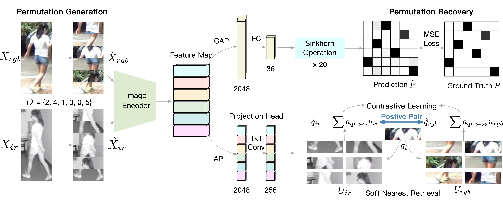

# Self-Supervised Modality-Aware Multiple Granularity Pre-Training for RGB-Infrared Person Re-Identification

This is the offical implementation of the paper 'Self-Supervised Modality-Aware Multiple Granularity Pre-Training for RGB-Infrared Person Re-Identification'.

# To Do List (The code is coming soon!)
